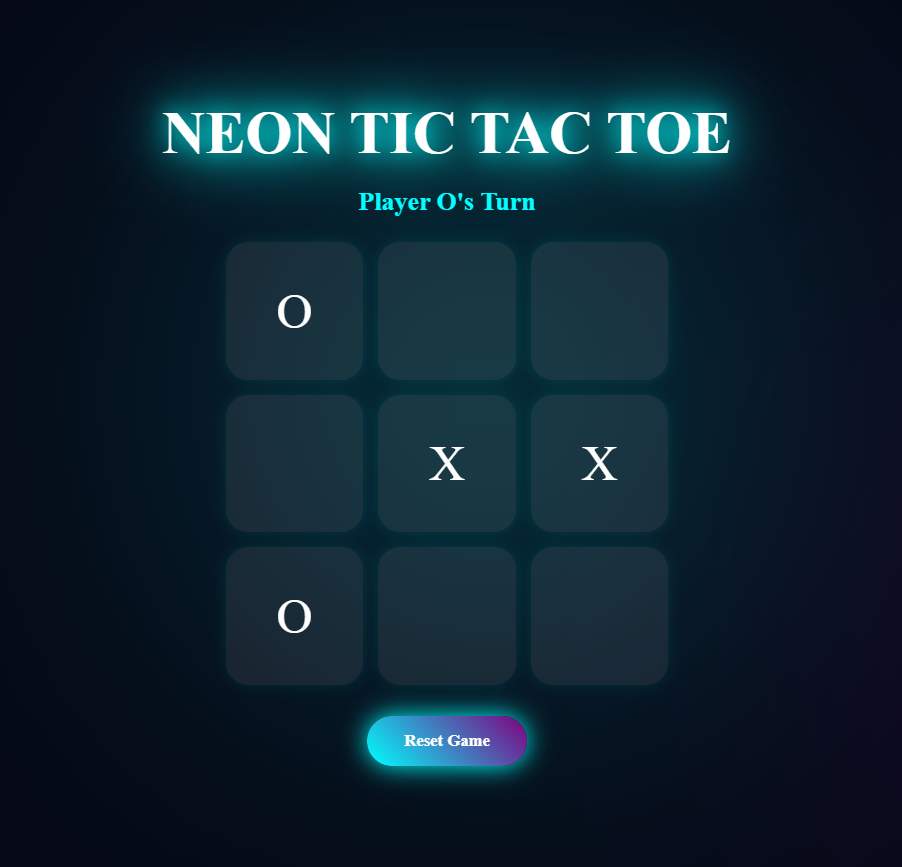

# 🎮 Neon Tic Tac Toe

A modern interactive Tic Tac Toe game built using HTML, CSS, and JavaScript.  
It focuses on game logic, DOM manipulation, and smooth UI animations.

---

## ✨ Features

- 🎯 Two-player turn-based gameplay (O & X)
- 🧠 Win detection using winning patterns
- 🤝 Draw (tie) detection
- ✨ Winning combination highlight
- 🔄 Reset & restart functionality
- 🎨 Neon animated UI with hover effects
- ⚡ Smooth transitions and interactions

---

## 🛠️ Tech Stack

- HTML (Structure)
- CSS (Styling & Animations)
- JavaScript (Game Logic & DOM Manipulation)

---

## 📸 Preview

---

## 🎯 How to Play

- Player O starts first
- Players take turns marking boxes
- First to get 3 in a row wins
- If all boxes are filled → Match Draw
- Click reset or play again to restart

---

## 📂 Project Structure

- index.html → UI structure  
- style.css → Styling & animations  
- app.js → Game logic  

---

## 💡 Key Learnings

- JavaScript DOM manipulation  
- Event handling  
- Game state management  
- Conditional logic implementation  
- UI/UX design using CSS animations  

---

## 👩‍💻 Author

**Jiya Arora**  
GitHub: https://github.com/jiya170  
Email: jiyaarorahmh@gmail.com  

---

⭐ If you like this project, please give it a star!
